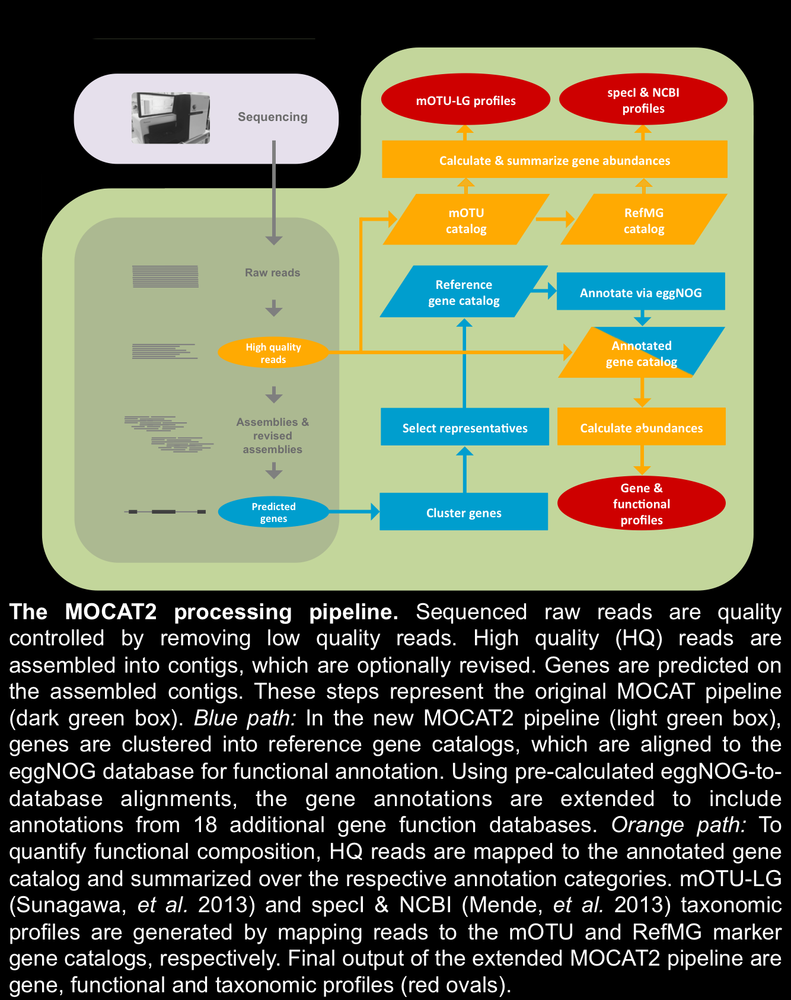

# a MicroBiome Annotator

## BackGround

现在的 Microbiome 分析 WGS 数据，是通过组装成 contig ，然后[将其比对到某个基因集上](http://mocat.embl.de/about.html)，从而获得基因功能等注释信息。



## Brief

本研究将在前人用 BLAT 做比对注释 的基础上，添加按物种表型划分可能性优先级的功能。

其中，物种分类使用倾向按特征划分的类 ontology 的划分，而非纯粹的 taxonomy，以便将不同功能分开。如：[NCBI Taxonomy](http://www.ncbi.nlm.nih.gov/taxonomy)。

由于人体表微生物包括真菌，计划在[细菌](http://www.ncbi.nlm.nih.gov/Taxonomy/Browser/wwwtax.cgi?mode=Undef&name=Bacteria&lvl=2&srchmode=1&keep=1&unlock)基础上，添加[真菌](http://www.ncbi.nlm.nih.gov/Taxonomy/Browser/wwwtax.cgi?id=4751)。

## Example Cases

### Type 1: Annoate with Given Priority

对肠道微生物组的分析，这些不可能的菌排后面：噬酸、硫细菌、蓝细菌。
对体表微生物的分析，把厌氧的排后面。

### Type 2: 相似的生态位包含营养型相似的复数物种，找到一个则期望有一堆

若样品分析结果显著表明其中含有硫细菌，则其中含有其它厌氧生物的概率增加，此时需要把厌氧生物的分值提高。

## Details

* NCBI Taxonomy 的各级节点具有的表型的 tag，可以通过对 PubMed 进行 text mining 得到。相关技术在 IT 领域很常见。
* 每类功能内的比对的 hit，可以参考 BLAST 给出 [Expect (E) value](http://blast.ncbi.nlm.nih.gov/Blast.cgi?CMD=Web&PAGE_TYPE=BlastDocs&DOC_TYPE=FAQ#expect)。

## Flow

````
Ecological Niche => Tag Portions -.
                                  |
Taxonomy nodes => Tag List ---------> Taxonomy Prior Probability ->1
1.Indestial Flow:                                                  |
                                                                   |
Common Path: Sample DNA -> WGS -> contigs -> OTU -> Alignments ------> Refined alignments(output Top 5) -> Annotation (Goal)
                                                        |       |
2.ab initio Flow:                                       |       2<---------------------------------.
                                                        |                                          |
                                           Obvious alignments -> Tag Portions from Taxonomy -> Taxonomy Prior Probability
````

## Notes

* NCBI Taxonomy DB 记录在其`taxdump.tar.gz`中，可以通过[Ensembl API](http://asia.ensembl.org/info/docs/api/api_git.html)或直接用 MySQL 访问[其数据库](http://asia.ensembl.org/info/data/mysql.html)。
